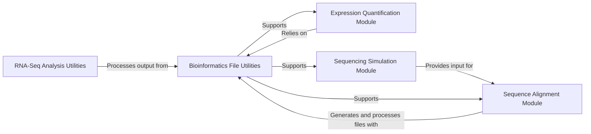

## Component Details

This system encapsulates the functionalities for interacting with various external bioinformatics command-line tools, providing a standardized way to define and execute these tools within the workflow. It covers key areas such as sequence alignment (BWA, STAR), expression quantification (Sailfish), file manipulation (Samtools), and sequencing simulation (Fluxsimulator). The system often includes version checking and command-line generation for these integrated tools, ensuring robust and reproducible bioinformatics workflows.

### RNA-Seq Analysis Utilities

This component provides specialized functionalities for RNA sequencing data analysis, primarily focusing on post-alignment metrics and quality control. It integrates with external bioinformatics tools like Picard to generate summary statistics from aligned reads, aiding in the assessment of sequencing and alignment quality, and includes utilities for version checking of these tools.

**Related Classes/Methods**:

- <a href="https://github.com/Novartis/railroadtracks/blob/master/src/rnaseq.py#L357-L360" target="_blank" rel="noopener noreferrer">`railroadtracks.src.rnaseq.PicardCollectAlignmentSummaryMetrics.version` (357:360)</a>

- <a href="https://github.com/Novartis/railroadtracks/blob/master/src/rnaseq.py#L315-L327" target="_blank" rel="noopener noreferrer">`railroadtracks.src.rnaseq._picard_getversion` (315:327)</a>

### Sequence Alignment Module

This module encapsulates the logic for aligning raw sequencing reads to a reference genome. It supports integration with popular alignment software such as BWA and STAR, managing the indexing of reference sequences and the execution of alignment processes to produce aligned read files, including robust version checking for the integrated aligners.

**Related Classes/Methods**:

- <a href="https://github.com/Novartis/railroadtracks/blob/master/src/model/aligners.py#L289-L292" target="_blank" rel="noopener noreferrer">`railroadtracks.src.model.aligners.BWAIndex.version` (289:292)</a>

- <a href="https://github.com/Novartis/railroadtracks/blob/master/src/model/aligners.py#L240-L263" target="_blank" rel="noopener noreferrer">`railroadtracks.src.model.aligners._bwa_version` (240:263)</a>

- <a href="https://github.com/Novartis/railroadtracks/blob/master/src/model/aligners.py#L687-L690" target="_blank" rel="noopener noreferrer">`railroadtracks.src.model.aligners.BWA.version` (687:690)</a>

- <a href="https://github.com/Novartis/railroadtracks/blob/master/src/model/aligners.py#L789-L792" target="_blank" rel="noopener noreferrer">`railroadtracks.src.model.aligners.StarIndex.version` (789:792)</a>

- <a href="https://github.com/Novartis/railroadtracks/blob/master/src/model/aligners.py#L746-L770" target="_blank" rel="noopener noreferrer">`railroadtracks.src.model.aligners._star_version` (746:770)</a>

- <a href="https://github.com/Novartis/railroadtracks/blob/master/src/model/aligners.py#L839-L842" target="_blank" rel="noopener noreferrer">`railroadtracks.src.model.aligners.StarAlign.version` (839:842)</a>

### Expression Quantification Module

Responsible for quantifying gene and transcript expression levels from aligned RNA sequencing data. This component interfaces with quantification tools like Sailfish, handling the specific parameters required for accurate expression measurement, including considerations for paired-end libraries and execution of the quantification process.

**Related Classes/Methods**:

- <a href="https://github.com/Novartis/railroadtracks/blob/master/src/model/quantify.py#L228-L294" target="_blank" rel="noopener noreferrer">`railroadtracks.src.model.quantify.SailfishQuant.run` (228:294)</a>

- <a href="https://github.com/Novartis/railroadtracks/blob/master/src/model/quantify.py#L219-L226" target="_blank" rel="noopener noreferrer">`railroadtracks.src.model.quantify.SailfishQuant._is_libtype_pe` (219:226)</a>

### Bioinformatics File Utilities

This component offers a collection of general-purpose utilities for handling and manipulating common bioinformatics file formats, particularly those related to sequencing data like SAM and BAM files. It includes functionalities for file pattern matching, iteration over file patterns, and wrappers for SAMtools operations such as filtering, format conversion, sorting, and version checking.

**Related Classes/Methods**:

- <a href="https://github.com/Novartis/railroadtracks/blob/master/src/model/files.py#L120-L128" target="_blank" rel="noopener noreferrer">`railroadtracks.src.model.files.FilePattern.__init__` (120:128)</a>

- <a href="https://github.com/Novartis/railroadtracks/blob/master/src/model/files.py#L145-L149" target="_blank" rel="noopener noreferrer">`railroadtracks.src.model.files.FilePattern.__iter__` (145:149)</a>

- <a href="https://github.com/Novartis/railroadtracks/blob/master/src/model/files.py#L151-L152" target="_blank" rel="noopener noreferrer">`railroadtracks.src.model.files.FilePattern.iteritems` (151:152)</a>

- <a href="https://github.com/Novartis/railroadtracks/blob/master/src/model/files.py#L250-L253" target="_blank" rel="noopener noreferrer">`railroadtracks.src.model.files.SamtoolsFilter.version` (250:253)</a>

- <a href="https://github.com/Novartis/railroadtracks/blob/master/src/model/files.py#L375-L391" target="_blank" rel="noopener noreferrer">`railroadtracks.src.model.files.samtools_getversion` (375:391)</a>

- <a href="https://github.com/Novartis/railroadtracks/blob/master/src/model/files.py#L312-L315" target="_blank" rel="noopener noreferrer">`railroadtracks.src.model.files.SamtoolsSamToBam.version` (312:315)</a>

- <a href="https://github.com/Novartis/railroadtracks/blob/master/src/model/files.py#L360-L363" target="_blank" rel="noopener noreferrer">`railroadtracks.src.model.files.SamtoolsBamToSam.version` (360:363)</a>

- <a href="https://github.com/Novartis/railroadtracks/blob/master/src/model/files.py#L464-L467" target="_blank" rel="noopener noreferrer">`railroadtracks.src.model.files.SamtoolsSorterByID.version` (464:467)</a>

### Sequencing Simulation Module

This module provides capabilities for simulating synthetic sequencing reads and for parsing various biological data formats. It includes functionalities for generating random FASTQ reads, handling GFF and FASTA file parsing, and integrating with simulation tools like Fluxsimulator to model gene expression and sequencing processes, including version checking and utilities for splitting merged paired-end reads.

**Related Classes/Methods**:

- <a href="https://github.com/Novartis/railroadtracks/blob/master/src/model/simulate.py#L58-L71" target="_blank" rel="noopener noreferrer">`railroadtracks.src.model.simulate.readfasta_iter` (58:71)</a>

- <a href="https://github.com/Novartis/railroadtracks/blob/master/src/model/simulate.py#L76-L85" target="_blank" rel="noopener noreferrer">`railroadtracks.src.model.simulate.readgff_iter` (76:85)</a>

- <a href="https://github.com/Novartis/railroadtracks/blob/master/src/model/simulate.py#L87-L93" target="_blank" rel="noopener noreferrer">`railroadtracks.src.model.simulate.entryfrom_gff` (87:93)</a>

- <a href="https://github.com/Novartis/railroadtracks/blob/master/src/model/simulate.py#L104-L119" target="_blank" rel="noopener noreferrer">`railroadtracks.src.model.simulate.randomfastq` (104:119)</a>

- <a href="https://github.com/Novartis/railroadtracks/blob/master/src/model/simulate.py#L95-L100" target="_blank" rel="noopener noreferrer">`railroadtracks.src.model.simulate.randomreadstart` (95:100)</a>

- <a href="https://github.com/Novartis/railroadtracks/blob/master/src/model/simulate.py#L134-L159" target="_blank" rel="noopener noreferrer">`railroadtracks.src.model.simulate.randomfastq_pe` (134:159)</a>

- <a href="https://github.com/Novartis/railroadtracks/blob/master/src/model/simulate.py#L161-L184" target="_blank" rel="noopener noreferrer">`railroadtracks.src.model.simulate.randomPEreads` (161:184)</a>

- <a href="https://github.com/Novartis/railroadtracks/blob/master/src/model/simulate.py#L325-L328" target="_blank" rel="noopener noreferrer">`railroadtracks.src.model.simulate.FluxsimulatorExpression.version` (325:328)</a>

- <a href="https://github.com/Novartis/railroadtracks/blob/master/src/model/simulate.py#L271-L294" target="_blank" rel="noopener noreferrer">`railroadtracks.src.model.simulate._fluxsimulator_version` (271:294)</a>

- <a href="https://github.com/Novartis/railroadtracks/blob/master/src/model/simulate.py#L404-L407" target="_blank" rel="noopener noreferrer">`railroadtracks.src.model.simulate.FluxsimulatorSequencing.version` (404:407)</a>

- <a href="https://github.com/Novartis/railroadtracks/blob/master/src/model/simulate.py#L409-L465" target="_blank" rel="noopener noreferrer">`railroadtracks.src.model.simulate.FluxsimulatorSequencing.run` (409:465)</a>

- <a href="https://github.com/Novartis/railroadtracks/blob/master/src/model/simulate.py#L197-L226" target="_blank" rel="noopener noreferrer">`railroadtracks.src.model.simulate._split_mergedpairs` (197:226)</a>

- <a href="https://github.com/Novartis/railroadtracks/blob/master/src/model/simulate.py#L480-L485" target="_blank" rel="noopener noreferrer">`railroadtracks.src.model.simulate.FluxsimulatorPro.__iter__` (480:485)</a>

### [FAQ](https://github.com/CodeBoarding/GeneratedOnBoardings/tree/main?tab=readme-ov-file#faq)