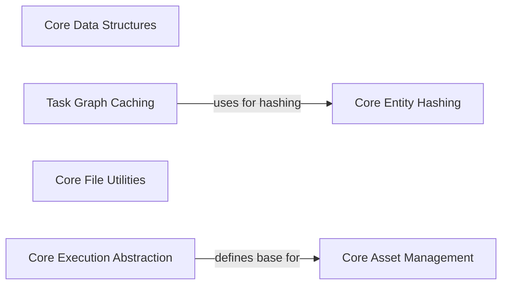

## Component Details

This graph provides an overview of the core data structures and foundational components within the `railroadtracks` project. It illustrates how fundamental abstract base classes, data structures, hashing mechanisms, file utilities, execution abstractions, and asset management functionalities are defined and interconnected to provide a consistent and robust foundation for the system's operations, ensuring interoperability and efficient data handling.

### Core Data Structures

Defines the fundamental abstract base classes and data structures used throughout the system, such as SavedEntityAbstract, File, StepAbstract, and AssetSet. These provide a common, consistent foundation for representing data, steps, and assets across different components, ensuring interoperability and type safety.

**Related Classes/Methods**:

- <a href="https://github.com/Novartis/railroadtracks/blob/master/src/core.py#L87-L90" target="_blank" rel="noopener noreferrer">`railroadtracks.src.core.SavedEntityAbstract.hashdb` (87:90)</a>

- <a href="https://github.com/Novartis/railroadtracks/blob/master/src/core.py#L125-L138" target="_blank" rel="noopener noreferrer">`railroadtracks.src.core.File.__init__` (125:138)</a>

- <a href="https://github.com/Novartis/railroadtracks/blob/master/src/core.py#L252-L257" target="_blank" rel="noopener noreferrer">`railroadtracks.src.core.StepAbstract.uei` (252:257)</a>

- <a href="https://github.com/Novartis/railroadtracks/blob/master/src/core.py#L144-L148" target="_blank" rel="noopener noreferrer">`railroadtracks.src.core.File._setname` (144:148)</a>

- <a href="https://github.com/Novartis/railroadtracks/blob/master/src/core.py#L397-L415" target="_blank" rel="noopener noreferrer">`railroadtracks.src.core.AssetSet.createundefined` (397:415)</a>

- <a href="https://github.com/Novartis/railroadtracks/blob/master/src/core.py#L426-L428" target="_blank" rel="noopener noreferrer">`railroadtracks.src.core.assetfactory` (426:428)</a>

- <a href="https://github.com/Novartis/railroadtracks/blob/master/src/core.py#L442-L456" target="_blank" rel="noopener noreferrer">`railroadtracks.src.core.AssetsStep.__init__` (442:456)</a>

### Task Graph Caching

This component is responsible for managing cached persistent task graphs, specifically for identifying and storing entities and sequences efficiently by leveraging hashing mechanisms provided by core utilities.

**Related Classes/Methods**:

- <a href="https://github.com/Novartis/railroadtracks/blob/master/src/hortator.py#L2031-L2039" target="_blank" rel="noopener noreferrer">`railroadtracks.src.hortator.CachedPersistentTaskGraph.id_stored_entity` (2031:2039)</a>

- <a href="https://github.com/Novartis/railroadtracks/blob/master/src/hortator.py#L2042-L2056" target="_blank" rel="noopener noreferrer">`railroadtracks.src.hortator.CachedPersistentTaskGraph.id_stored_sequence` (2042:2056)</a>

### Core Entity Hashing

This fundamental component provides a generic mechanism for hashing components of saved entities, crucial for unique identification and integrity across the system. It serves as a utility for other components requiring entity hashing.

**Related Classes/Methods**:

- <a href="https://github.com/Novartis/railroadtracks/blob/master/src/core.py#L82-L84" target="_blank" rel="noopener noreferrer">`railroadtracks.src.core.SavedEntityAbstract._hash_components` (82:84)</a>

- <a href="https://github.com/Novartis/railroadtracks/blob/master/src/core.py#L87-L90" target="_blank" rel="noopener noreferrer">`railroadtracks.src.core.SavedEntityAbstract.hashdb` (87:90)</a>

### Core File Utilities

This component offers core utilities for handling file objects, including their initialization and validation of extensions to ensure data integrity and proper file naming conventions.

**Related Classes/Methods**:

- <a href="https://github.com/Novartis/railroadtracks/blob/master/src/core.py#L125-L138" target="_blank" rel="noopener noreferrer">`railroadtracks.src.core.File.__init__` (125:138)</a>

- <a href="https://github.com/Novartis/railroadtracks/blob/master/src/core.py#L144-L148" target="_blank" rel="noopener noreferrer">`railroadtracks.src.core.File._setname` (144:148)</a>

- <a href="https://github.com/Novartis/railroadtracks/blob/master/src/core.py#L107-L111" target="_blank" rel="noopener noreferrer">`railroadtracks.src.core._check_extension` (107:111)</a>

### Core Execution Abstraction

This component defines abstract steps and provides mechanisms for generating unified execution information, serving as a base for various operational processes and ensuring consistent tracking of execution details.

**Related Classes/Methods**:

- <a href="https://github.com/Novartis/railroadtracks/blob/master/src/core.py#L252-L257" target="_blank" rel="noopener noreferrer">`railroadtracks.src.core.StepAbstract.uei` (252:257)</a>

- <a href="https://github.com/Novartis/railroadtracks/blob/master/src/core.py#L260-L269" target="_blank" rel="noopener noreferrer">`railroadtracks.src.core.UnifiedExecInfo` (260:269)</a>

### Core Asset Management

This component manages the creation, definition, and validation of assets and asset sets, forming the backbone for data and resource handling within operational steps. It includes functionalities for creating undefined assets and validating asset structures.

**Related Classes/Methods**:

- <a href="https://github.com/Novartis/railroadtracks/blob/master/src/core.py#L397-L415" target="_blank" rel="noopener noreferrer">`railroadtracks.src.core.AssetSet.createundefined` (397:415)</a>

- <a href="https://github.com/Novartis/railroadtracks/blob/master/src/core.py#L341-L424" target="_blank" rel="noopener noreferrer">`railroadtracks.src.core.AssetSet` (341:424)</a>

- <a href="https://github.com/Novartis/railroadtracks/blob/master/src/core.py#L426-L428" target="_blank" rel="noopener noreferrer">`railroadtracks.src.core.assetfactory` (426:428)</a>

- <a href="https://github.com/Novartis/railroadtracks/blob/master/src/core.py#L290-L338" target="_blank" rel="noopener noreferrer">`railroadtracks.src.core.AssetMeta` (290:338)</a>

- <a href="https://github.com/Novartis/railroadtracks/blob/master/src/core.py#L442-L456" target="_blank" rel="noopener noreferrer">`railroadtracks.src.core.AssetsStep.__init__` (442:456)</a>

- <a href="https://github.com/Novartis/railroadtracks/blob/master/src/core.py#L458-L477" target="_blank" rel="noopener noreferrer">`railroadtracks.src.core.AssetsStep._check` (458:477)</a>

### [FAQ](https://github.com/CodeBoarding/GeneratedOnBoardings/tree/main?tab=readme-ov-file#faq)