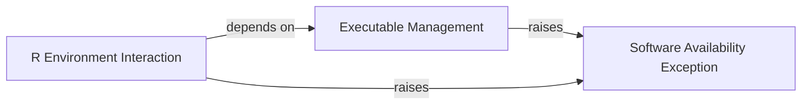

## Component Details

The External Environment Management subsystem handles interactions with the external system environment, including checking for the presence and version of executable software (e.g., R, BWA, Star) and managing specific package versions required by various tools. This component ensures that the necessary external dependencies for bioinformatics tools are met before execution.

### Executable Management

This component is responsible for locating and verifying the presence of executable files within the system's PATH. It provides core functionality for checking if a given executable exists and is accessible, and it raises a specific exception if the software is not found.

**Related Classes/Methods**:

- <a href="https://github.com/Novartis/railroadtracks/blob/master/src/environment.py#L34-L45" target="_blank" rel="noopener noreferrer">`railroadtracks.src.environment._find_executable` (34:45)</a>

- <a href="https://github.com/Novartis/railroadtracks/blob/master/src/environment.py#L48-L56" target="_blank" rel="noopener noreferrer">`railroadtracks.src.environment.Executable.__init__` (48:56)</a>

- <a href="https://github.com/Novartis/railroadtracks/blob/master/src/environment.py#L64-L69" target="_blank" rel="noopener noreferrer">`railroadtracks.src.environment.Executable.ispresent` (64:69)</a>

### R Environment Interaction

This component handles interactions with the R statistical programming environment. It provides methods for checking R package versions, running R code snippets, and managing data exchange between Python and R, particularly for importing variables into the R global environment.

**Related Classes/Methods**:

- <a href="https://github.com/Novartis/railroadtracks/blob/master/src/environment.py#L87-L111" target="_blank" rel="noopener noreferrer">`railroadtracks.src.environment.R.packageversion` (87:111)</a>

- <a href="https://github.com/Novartis/railroadtracks/blob/master/src/environment.py#L113-L121" target="_blank" rel="noopener noreferrer">`railroadtracks.src.environment.R.packageversion_or_none` (113:121)</a>

- <a href="https://github.com/Novartis/railroadtracks/blob/master/src/environment.py#L123-L178" target="_blank" rel="noopener noreferrer">`railroadtracks.src.environment.R.run_snippet` (123:178)</a>

- <a href="https://github.com/Novartis/railroadtracks/blob/master/src/environment.py#L201-L203" target="_blank" rel="noopener noreferrer">`railroadtracks.src.environment.R.__repr__` (201:203)</a>

### Software Availability Exception

This component defines a custom exception class used to signal when a required software or package is missing from the system. It is a specialized error type that helps in handling scenarios where external dependencies are not met.

**Related Classes/Methods**:

- <a href="https://github.com/Novartis/railroadtracks/blob/master/src/environment.py#L27-L28" target="_blank" rel="noopener noreferrer">`railroadtracks.src.environment.MissingSoftware` (27:28)</a>

### [FAQ](https://github.com/CodeBoarding/GeneratedOnBoardings/tree/main?tab=readme-ov-file#faq)