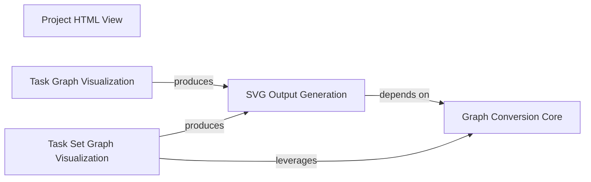

## Component Details

The IPython Visualization subsystem is responsible for generating interactive visual representations of project and task graphs within IPython environments. It converts internal graph structures, such as NetworkX DiGraphs, into PyGraphviz AGraph objects, which are then rendered into HTML or SVG formats. This allows users to effectively visualize workflow, task dependencies, and overall project status, enhancing understanding and monitoring of complex processes.

### Project HTML View

Generates an HTML representation of a project, integrating various sub-views related to project storage, activities, and results.

**Related Classes/Methods**:

- <a href="https://github.com/Novartis/railroadtracks/blob/master/src/ipython.py#L121-L127" target="_blank" rel="noopener noreferrer">`railroadtracks.src.ipython.html_project_view` (121:127)</a>

- <a href="https://github.com/Novartis/railroadtracks/blob/master/src/ipython.py#L40-L45" target="_blank" rel="noopener noreferrer">`railroadtracks.src.ipython.html_project_view_storage` (40:45)</a>

- <a href="https://github.com/Novartis/railroadtracks/blob/master/src/ipython.py#L48-L54" target="_blank" rel="noopener noreferrer">`railroadtracks.src.ipython.html_project_view_activities` (48:54)</a>

- <a href="https://github.com/Novartis/railroadtracks/blob/master/src/ipython.py#L57-L63" target="_blank" rel="noopener noreferrer">`railroadtracks.src.ipython.html_project_view_results` (57:63)</a>

### Graph Conversion Core

The fundamental component for transforming NetworkX DiGraphs into PyGraphviz AGraph objects, including detailed node and edge styling based on their properties.

**Related Classes/Methods**:

- <a href="https://github.com/Novartis/railroadtracks/blob/master/src/ipython.py#L214-L261" target="_blank" rel="noopener noreferrer">`railroadtracks.src.ipython.agraph_fromdigraph` (214:261)</a>

- <a href="https://github.com/Novartis/railroadtracks/blob/master/src/ipython.py#L152-L167" target="_blank" rel="noopener noreferrer">`railroadtracks.src.ipython.node_label` (152:167)</a>

- <a href="https://github.com/Novartis/railroadtracks/blob/master/src/ipython.py#L202-L211" target="_blank" rel="noopener noreferrer">`railroadtracks.src.ipython._get_pred_done` (202:211)</a>

- <a href="https://github.com/Novartis/railroadtracks/blob/master/src/ipython.py#L175-L183" target="_blank" rel="noopener noreferrer">`railroadtracks.src.ipython.default_tasknode_func` (175:183)</a>

- <a href="https://github.com/Novartis/railroadtracks/blob/master/src/ipython.py#L185-L192" target="_blank" rel="noopener noreferrer">`railroadtracks.src.ipython.default_assetnode` (185:192)</a>

- <a href="https://github.com/Novartis/railroadtracks/blob/master/src/ipython.py#L194-L200" target="_blank" rel="noopener noreferrer">`railroadtracks.src.ipython.default_assetseqnode` (194:200)</a>

### SVG Output Generation

Responsible for taking a PyGraphviz AGraph object and rendering it into an SVG image format for display.

**Related Classes/Methods**:

- <a href="https://github.com/Novartis/railroadtracks/blob/master/src/ipython.py#L264-L267" target="_blank" rel="noopener noreferrer">`railroadtracks.src.ipython._plot_digraph` (264:267)</a>

- <a href="https://github.com/Novartis/railroadtracks/blob/master/src/ipython.py#L269-L270" target="_blank" rel="noopener noreferrer">`railroadtracks.src.ipython.svg_digraph` (269:270)</a>

### Task Graph Visualization

Provides specific functionalities for visualizing individual task graphs in SVG format.

**Related Classes/Methods**:

- <a href="https://github.com/Novartis/railroadtracks/blob/master/src/ipython.py#L272-L274" target="_blank" rel="noopener noreferrer">`railroadtracks.src.ipython.svg_taskgraph_view` (272:274)</a>

### Task Set Graph Visualization

Offers functionalities for visualizing entire task set graphs, including their conversion to AGraph and subsequent SVG rendering.

**Related Classes/Methods**:

- <a href="https://github.com/Novartis/railroadtracks/blob/master/src/ipython.py#L276-L307" target="_blank" rel="noopener noreferrer">`railroadtracks.src.ipython.agraph_fromtasksetgraph` (276:307)</a>

- <a href="https://github.com/Novartis/railroadtracks/blob/master/src/ipython.py#L309-L316" target="_blank" rel="noopener noreferrer">`railroadtracks.src.ipython.svg_tasksetgraph_view` (309:316)</a>

### [FAQ](https://github.com/CodeBoarding/GeneratedOnBoardings/tree/main?tab=readme-ov-file#faq)