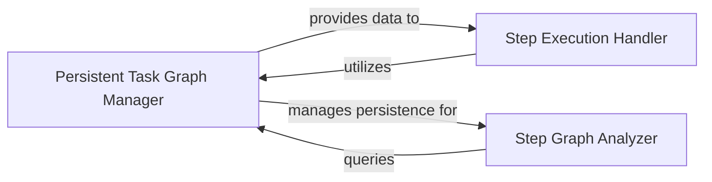

## Component Details

This graph represents the core components responsible for managing the persistent task graph within the Hortator subsystem. It outlines how tasks, steps, and assets are stored, retrieved, analyzed, and executed, forming the backbone for workflow persistence, dependency tracking, and state management. The main flow involves the Persistent Task Graph Manager handling all data persistence, the Step Graph Analyzer providing insights into task relationships, and the Step Execution Handler orchestrating the actual execution of individual steps, all interacting to maintain workflow integrity and enable features like caching and cleaning.

### Persistent Task Graph Manager

This component manages the persistent storage and retrieval of the task graph, including concrete steps, their associated sources, targets, and parameters. It interacts directly with the database to store and fetch task-related metadata and provides methods for identifying and adding various entities like step parameters, stored entities, and sequences. It also handles caching for improved performance.

**Related Classes/Methods**:

- <a href="https://github.com/Novartis/railroadtracks/blob/master/src/hortator.py#L682-L1908" target="_blank" rel="noopener noreferrer">`railroadtracks.src.hortator.PersistentTaskGraph` (682:1908)</a>

- <a href="https://github.com/Novartis/railroadtracks/blob/master/src/hortator.py#L1912-L2056" target="_blank" rel="noopener noreferrer">`railroadtracks.src.hortator.CachedPersistentTaskGraph` (1912:2056)</a>

- <a href="https://github.com/Novartis/railroadtracks/blob/master/src/hortator.py#L690-L721" target="_blank" rel="noopener noreferrer">`railroadtracks.src.hortator.PersistentTaskGraph.__init__` (690:721)</a>

- <a href="https://github.com/Novartis/railroadtracks/blob/master/src/hortator.py#L773-L799" target="_blank" rel="noopener noreferrer">`railroadtracks.src.hortator.PersistentTaskGraph.iter_steps` (773:799)</a>

- <a href="https://github.com/Novartis/railroadtracks/blob/master/src/hortator.py#L801-L854" target="_blank" rel="noopener noreferrer">`railroadtracks.src.hortator.PersistentTaskGraph._get_assets` (801:854)</a>

- <a href="https://github.com/Novartis/railroadtracks/blob/master/src/hortator.py#L892-L930" target="_blank" rel="noopener noreferrer">`railroadtracks.src.hortator.PersistentTaskGraph._get_stepconcrete` (892:930)</a>

- <a href="https://github.com/Novartis/railroadtracks/blob/master/src/hortator.py#L963-L976" target="_blank" rel="noopener noreferrer">`railroadtracks.src.hortator.PersistentTaskGraph._get_stepconcrete_from_storedentity` (963:976)</a>

- <a href="https://github.com/Novartis/railroadtracks/blob/master/src/hortator.py#L978-L995" target="_blank" rel="noopener noreferrer">`railroadtracks.src.hortator.PersistentTaskGraph.get_parenttask_of_storedentity` (978:995)</a>

- <a href="https://github.com/Novartis/railroadtracks/blob/master/src/hortator.py#L997-L1009" target="_blank" rel="noopener noreferrer">`railroadtracks.src.hortator.PersistentTaskGraph.get_targetstepconcrete` (997:1009)</a>

- <a href="https://github.com/Novartis/railroadtracks/blob/master/src/hortator.py#L1011-L1016" target="_blank" rel="noopener noreferrer">`railroadtracks.src.hortator.PersistentTaskGraph.get_srcassets` (1011:1016)</a>

- <a href="https://github.com/Novartis/railroadtracks/blob/master/src/hortator.py#L1018-L1023" target="_blank" rel="noopener noreferrer">`railroadtracks.src.hortator.PersistentTaskGraph.get_targetassets` (1018:1023)</a>

- <a href="https://github.com/Novartis/railroadtracks/blob/master/src/hortator.py#L1050-L1078" target="_blank" rel="noopener noreferrer">`railroadtracks.src.hortator.PersistentTaskGraph.id_stepparameters` (1050:1078)</a>

- <a href="https://github.com/Novartis/railroadtracks/blob/master/src/hortator.py#L1081-L1125" target="_blank" rel="noopener noreferrer">`railroadtracks.src.hortator.PersistentTaskGraph.id_stored_entity` (1081:1125)</a>

- <a href="https://github.com/Novartis/railroadtracks/blob/master/src/hortator.py#L1127-L1180" target="_blank" rel="noopener noreferrer">`railroadtracks.src.hortator.PersistentTaskGraph.id_stored_sequence` (1127:1180)</a>

- <a href="https://github.com/Novartis/railroadtracks/blob/master/src/hortator.py#L1182-L1207" target="_blank" rel="noopener noreferrer">`railroadtracks.src.hortator.PersistentTaskGraph.id_step_activity` (1182:1207)</a>

- <a href="https://github.com/Novartis/railroadtracks/blob/master/src/hortator.py#L1209-L1271" target="_blank" rel="noopener noreferrer">`railroadtracks.src.hortator.PersistentTaskGraph.id_step_type` (1209:1271)</a>

- <a href="https://github.com/Novartis/railroadtracks/blob/master/src/hortator.py#L1293-L1368" target="_blank" rel="noopener noreferrer">`railroadtracks.src.hortator.PersistentTaskGraph.id_step_variant` (1293:1368)</a>

- <a href="https://github.com/Novartis/railroadtracks/blob/master/src/hortator.py#L1382-L1393" target="_blank" rel="noopener noreferrer">`railroadtracks.src.hortator.PersistentTaskGraph.nconcrete_steps_status` (1382:1393)</a>

- <a href="https://github.com/Novartis/railroadtracks/blob/master/src/hortator.py#L1395-L1572" target="_blank" rel="noopener noreferrer">`railroadtracks.src.hortator.PersistentTaskGraph.id_stepconcrete` (1395:1572)</a>

- <a href="https://github.com/Novartis/railroadtracks/blob/master/src/hortator.py#L1574-L1635" target="_blank" rel="noopener noreferrer">`railroadtracks.src.hortator.PersistentTaskGraph._add_stepconcrete` (1574:1635)</a>

- <a href="https://github.com/Novartis/railroadtracks/blob/master/src/hortator.py#L1654-L1703" target="_blank" rel="noopener noreferrer">`railroadtracks.src.hortator.PersistentTaskGraph._insert_stepconcrete2storedentities` (1654:1703)</a>

- <a href="https://github.com/Novartis/railroadtracks/blob/master/src/hortator.py#L1753-L1795" target="_blank" rel="noopener noreferrer">`railroadtracks.src.hortator.PersistentTaskGraph._get_assetsofactivity` (1753:1795)</a>

- <a href="https://github.com/Novartis/railroadtracks/blob/master/src/hortator.py#L1797-L1803" target="_blank" rel="noopener noreferrer">`railroadtracks.src.hortator.PersistentTaskGraph.get_sourcesofactivity` (1797:1803)</a>

- <a href="https://github.com/Novartis/railroadtracks/blob/master/src/hortator.py#L1805-L1807" target="_blank" rel="noopener noreferrer">`railroadtracks.src.hortator.PersistentTaskGraph.find_targetsofactivity` (1805:1807)</a>

- <a href="https://github.com/Novartis/railroadtracks/blob/master/src/hortator.py#L1809-L1860" target="_blank" rel="noopener noreferrer">`railroadtracks.src.hortator.PersistentTaskGraph.get_targetsofactivity` (1809:1860)</a>

- <a href="https://github.com/Novartis/railroadtracks/blob/master/src/hortator.py#L1862-L1876" target="_blank" rel="noopener noreferrer">`railroadtracks.src.hortator.PersistentTaskGraph.get_targetsoftype` (1862:1876)</a>

- <a href="https://github.com/Novartis/railroadtracks/blob/master/src/hortator.py#L1878-L1903" target="_blank" rel="noopener noreferrer">`railroadtracks.src.hortator.PersistentTaskGraph.iter_finaltargets` (1878:1903)</a>

- <a href="https://github.com/Novartis/railroadtracks/blob/master/src/hortator.py#L1914-L1926" target="_blank" rel="noopener noreferrer">`railroadtracks.src.hortator.CachedPersistentTaskGraph.__init__` (1914:1926)</a>

- <a href="https://github.com/Novartis/railroadtracks/blob/master/src/hortator.py#L1928-L1936" target="_blank" rel="noopener noreferrer">`railroadtracks.src.hortator.CachedPersistentTaskGraph.id_step_type` (1928:1936)</a>

- <a href="https://github.com/Novartis/railroadtracks/blob/master/src/hortator.py#L1938-L1942" target="_blank" rel="noopener noreferrer">`railroadtracks.src.hortator.CachedPersistentTaskGraph._cache_id_step_type` (1938:1942)</a>

- <a href="https://github.com/Novartis/railroadtracks/blob/master/src/hortator.py#L1944-L1957" target="_blank" rel="noopener noreferrer">`railroadtracks.src.hortator.CachedPersistentTaskGraph.id_step_variant` (1944:1957)</a>

- <a href="https://github.com/Novartis/railroadtracks/blob/master/src/hortator.py#L1960-L2017" target="_blank" rel="noopener noreferrer">`railroadtracks.src.hortator.CachedPersistentTaskGraph.id_stepconcrete` (1960:2017)</a>

- <a href="https://github.com/Novartis/railroadtracks/blob/master/src/hortator.py#L2020-L2028" target="_blank" rel="noopener noreferrer">`railroadtracks.src.hortator.CachedPersistentTaskGraph.id_stepparameters` (2020:2028)</a>

- <a href="https://github.com/Novartis/railroadtracks/blob/master/src/hortator.py#L2031-L2039" target="_blank" rel="noopener noreferrer">`railroadtracks.src.hortator.CachedPersistentTaskGraph.id_stored_entity` (2031:2039)</a>

- <a href="https://github.com/Novartis/railroadtracks/blob/master/src/hortator.py#L2042-L2056" target="_blank" rel="noopener noreferrer">`railroadtracks.src.hortator.CachedPersistentTaskGraph.id_stored_sequence` (2042:2056)</a>

### Step Graph Analyzer

This component provides functionalities for analyzing the relationships between steps and stored entities within the task graph. It supports operations like adding steps, walking through destinations, and generating provenance or destination graphs, primarily by interacting with the underlying database IDs and graph structures.

**Related Classes/Methods**:

- <a href="https://github.com/Novartis/railroadtracks/blob/master/src/hortator.py#L128-L607" target="_blank" rel="noopener noreferrer">`railroadtracks.src.hortator.StepGraph` (128:607)</a>

- <a href="https://github.com/Novartis/railroadtracks/blob/master/src/hortator.py#L140-L151" target="_blank" rel="noopener noreferrer">`railroadtracks.src.hortator.StepGraph.__init__` (140:151)</a>

- <a href="https://github.com/Novartis/railroadtracks/blob/master/src/hortator.py#L163-L281" target="_blank" rel="noopener noreferrer">`railroadtracks.src.hortator.StepGraph.add` (163:281)</a>

- <a href="https://github.com/Novartis/railroadtracks/blob/master/src/hortator.py#L433-L464" target="_blank" rel="noopener noreferrer">`railroadtracks.src.hortator.StepGraph.destinationwalk_stepconcrete` (433:464)</a>

- <a href="https://github.com/Novartis/railroadtracks/blob/master/src/hortator.py#L466-L486" target="_blank" rel="noopener noreferrer">`railroadtracks.src.hortator.StepGraph.destinationwalk_storedentity` (466:486)</a>

- <a href="https://github.com/Novartis/railroadtracks/blob/master/src/hortator.py#L488-L543" target="_blank" rel="noopener noreferrer">`railroadtracks.src.hortator.StepGraph._graph_storedentity` (488:543)</a>

- <a href="https://github.com/Novartis/railroadtracks/blob/master/src/hortator.py#L545-L550" target="_blank" rel="noopener noreferrer">`railroadtracks.src.hortator.StepGraph.provenancegraph_storedentity` (545:550)</a>

- <a href="https://github.com/Novartis/railroadtracks/blob/master/src/hortator.py#L551-L556" target="_blank" rel="noopener noreferrer">`railroadtracks.src.hortator.StepGraph.destinationgraph_stepconcrete` (551:556)</a>

- <a href="https://github.com/Novartis/railroadtracks/blob/master/src/hortator.py#L557-L562" target="_blank" rel="noopener noreferrer">`railroadtracks.src.hortator.StepGraph.destinationgraph_storedentity` (557:562)</a>

- <a href="https://github.com/Novartis/railroadtracks/blob/master/src/hortator.py#L567-L607" target="_blank" rel="noopener noreferrer">`railroadtracks.src.hortator.StepGraph.cleantargets_stepconcrete` (567:607)</a>

### Step Execution Handler

This component is responsible for executing individual processing steps within the `railroadtracks` system. It prepares execution information, invokes the unified execution runner, and handles the conversion of model-specific steps into a format suitable for execution.

**Related Classes/Methods**:

- <a href="https://github.com/Novartis/railroadtracks/blob/master/src/hortator.py#L58-L104" target="_blank" rel="noopener noreferrer">`railroadtracks.src.hortator.Step` (58:104)</a>

- <a href="https://github.com/Novartis/railroadtracks/blob/master/src/hortator.py#L89-L104" target="_blank" rel="noopener noreferrer">`railroadtracks.src.hortator.Step.run` (89:104)</a>

### [FAQ](https://github.com/CodeBoarding/GeneratedOnBoardings/tree/main?tab=readme-ov-file#faq)