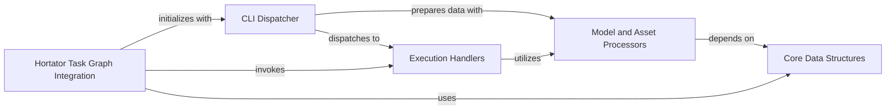

## Component Details

The Unified Execution Core (Unifex) is the central runtime component for executing workflow steps. The `CLI Dispatcher` acts as the entry point, parsing arguments and directing control to `Execution Handlers` for specific operations like running models or querying information. `Model and Asset Processors` provide utilities for managing model instances, handling arguments, and processing assets, supporting both the `CLI Dispatcher` and `Execution Handlers`. The `Hortator Task Graph Integration` component leverages Unifex to execute steps within larger task graphs, interacting with both the `CLI Dispatcher` for initialization and `Execution Handlers` for task execution. Fundamental `Core Data Structures` underpin the system, providing essential data management for `Model and Asset Processors` and `Hortator Task Graph Integration`.

### CLI Dispatcher

This sub-component serves as the primary command-line interface entry point for the Unifex core. It parses user arguments from the command line and dispatches control to the appropriate execution handler based on the requested action (e.g., run, version, activities, or model query). It also initializes the global step dictionary, which maps command names to their corresponding execution logic.

**Related Classes/Methods**:

- <a href="https://github.com/Novartis/railroadtracks/blob/master/src/unifex.py#L264-L386" target="_blank" rel="noopener noreferrer">`railroadtracks.src.unifex.unified_exec` (264:386)</a>

- <a href="https://github.com/Novartis/railroadtracks/blob/master/src/unifex.py#L72-L90" target="_blank" rel="noopener noreferrer">`railroadtracks.src.unifex._make_stepdict` (72:90)</a>

### Execution Handlers

This sub-component encapsulates the core logic for different execution modes supported by Unifex. It includes specialized functions for running specific bioinformatics models (unified_exec_run), querying model versions (unified_exec_version), listing associated activities (unified_exec_activities), and inspecting detailed model information (unified_exec_model). These handlers interact directly with model instances and process the prepared arguments to perform their respective operations.

**Related Classes/Methods**:

- <a href="https://github.com/Novartis/railroadtracks/blob/master/src/unifex.py#L194-L245" target="_blank" rel="noopener noreferrer">`railroadtracks.src.unifex.unified_exec_run` (194:245)</a>

- <a href="https://github.com/Novartis/railroadtracks/blob/master/src/unifex.py#L247-L251" target="_blank" rel="noopener noreferrer">`railroadtracks.src.unifex.unified_exec_version` (247:251)</a>

- <a href="https://github.com/Novartis/railroadtracks/blob/master/src/unifex.py#L253-L257" target="_blank" rel="noopener noreferrer">`railroadtracks.src.unifex.unified_exec_activities` (253:257)</a>

- <a href="https://github.com/Novartis/railroadtracks/blob/master/src/unifex.py#L259-L262" target="_blank" rel="noopener noreferrer">`railroadtracks.src.unifex.unified_exec_model` (259:262)</a>

### Model and Asset Processors

This sub-component provides essential utility functions for managing model instances, extracting and processing command-line arguments, constructing input and output AssetSet objects, and configuring logging. It ensures that the correct model class is instantiated based on user input, that all necessary input parameters are correctly parsed and prepared, and that output assets are properly managed before delegating execution to the model's run method. It also handles error reporting through UnifexError.

**Related Classes/Methods**:

- <a href="https://github.com/Novartis/railroadtracks/blob/master/src/unifex.py#L143-L167" target="_blank" rel="noopener noreferrer">`railroadtracks.src.unifex._model_instance` (143:167)</a>

- <a href="https://github.com/Novartis/railroadtracks/blob/master/src/unifex.py#L93-L101" target="_blank" rel="noopener noreferrer">`railroadtracks.src.unifex._extract_argdict` (93:101)</a>

- <a href="https://github.com/Novartis/railroadtracks/blob/master/src/unifex.py#L170-L192" target="_blank" rel="noopener noreferrer">`railroadtracks.src.unifex.build_AssetSet` (170:192)</a>

- <a href="https://github.com/Novartis/railroadtracks/blob/master/src/unifex.py#L67-L70" target="_blank" rel="noopener noreferrer">`railroadtracks.src.unifex._set_logging` (67:70)</a>

- <a href="https://github.com/Novartis/railroadtracks/blob/master/src/unifex.py#L33-L34" target="_blank" rel="noopener noreferrer">`railroadtracks.src.unifex.UnifexError` (33:34)</a>

### Hortator Task Graph Integration

This component from the hortator module integrates with the Unifex core to enable the execution of individual steps within a larger task graph and the initialization of persistent task graphs. It leverages Unifex's capabilities to run specific bioinformatics tools as part of a directed acyclic graph (DAG) of tasks, allowing for complex workflow orchestration.

**Related Classes/Methods**:

- <a href="https://github.com/Novartis/railroadtracks/blob/master/src/hortator.py#L89-L104" target="_blank" rel="noopener noreferrer">`railroadtracks.src.hortator.Step.run` (89:104)</a>

- <a href="https://github.com/Novartis/railroadtracks/blob/master/src/hortator.py#L690-L721" target="_blank" rel="noopener noreferrer">`railroadtracks.src.hortator.PersistentTaskGraph.__init__` (690:721)</a>

### Core Data Structures

This component provides fundamental data structures and utility functions from the core module that are essential for the operation of Unifex. Specifically, it includes mechanisms for managing step lists (steplist) and unified execution information (UnifiedExecInfo), which are crucial for Unifex to identify and process different bioinformatics tools and their associated metadata.

**Related Classes/Methods**:

- <a href="https://github.com/Novartis/railroadtracks/blob/master/src/core.py#L486-L508" target="_blank" rel="noopener noreferrer">`railroadtracks.src.core.steplist` (486:508)</a>

- `railroadtracks.src.core.UnifiedExecInfo` (full file reference)

### [FAQ](https://github.com/CodeBoarding/GeneratedOnBoardings/tree/main?tab=readme-ov-file#faq)