```mermaid

graph LR

    Unified_Execution_Core_Unifex_["Unified Execution Core (Unifex)"]

    Persistent_Task_Graph_Hortator_Core_["Persistent Task Graph (Hortator Core)"]

    Easy_API["Easy API"]

    Bioinformatics_Tools_Integration["Bioinformatics Tools Integration"]

    Core_Data_Structures["Core Data Structures"]

    External_Environment_Management["External Environment Management"]

    IPython_Visualization["IPython Visualization"]

    Unified_Execution_Core_Unifex_ -- "executes steps from" --> Persistent_Task_Graph_Hortator_Core_

    Unified_Execution_Core_Unifex_ -- "utilizes" --> Core_Data_Structures

    Persistent_Task_Graph_Hortator_Core_ -- "manages" --> Core_Data_Structures

    Persistent_Task_Graph_Hortator_Core_ -- "integrates" --> Bioinformatics_Tools_Integration

    Easy_API -- "builds upon" --> Persistent_Task_Graph_Hortator_Core_

    Easy_API -- "generates commands for" --> Unified_Execution_Core_Unifex_

    Bioinformatics_Tools_Integration -- "uses" --> External_Environment_Management

    IPython_Visualization -- "visualizes" --> Persistent_Task_Graph_Hortator_Core_

    IPython_Visualization -- "visualizes" --> Easy_API

    click Unified_Execution_Core_Unifex_ href "https://github.com/Novartis/railroadtracks/blob/main/.codeboarding//Unified Execution Core (Unifex).md" "Details"

    click Persistent_Task_Graph_Hortator_Core_ href "https://github.com/Novartis/railroadtracks/blob/main/.codeboarding//Persistent Task Graph (Hortator Core).md" "Details"

    click Easy_API href "https://github.com/Novartis/railroadtracks/blob/main/.codeboarding//Easy API.md" "Details"

    click Bioinformatics_Tools_Integration href "https://github.com/Novartis/railroadtracks/blob/main/.codeboarding//Bioinformatics Tools Integration.md" "Details"

    click Core_Data_Structures href "https://github.com/Novartis/railroadtracks/blob/main/.codeboarding//Core Data Structures.md" "Details"

    click External_Environment_Management href "https://github.com/Novartis/railroadtracks/blob/main/.codeboarding//External Environment Management.md" "Details"

    click IPython_Visualization href "https://github.com/Novartis/railroadtracks/blob/main/.codeboarding//IPython Visualization.md" "Details"

```

## Component Details

The `railroadtracks` project provides a robust framework for defining, managing, and executing bioinformatics workflows. It leverages a persistent task graph to track dependencies and provenance, offers a simplified high-level API for user interaction, integrates with various external bioinformatics tools, and provides visualization capabilities for workflow monitoring. The core functionality revolves around the execution of defined steps, managed by a central execution core, with strong emphasis on persistent data management and environmental dependency handling.

### Unified Execution Core (Unifex)

The central runtime component responsible for executing individual steps within a workflow. It handles argument parsing, logging, model instantiation, asset management (sources and targets), and delegates the actual execution to the specific model's run method. It acts as the bridge between the abstract task definitions and the concrete execution of bioinformatics tools.

**Related Classes/Methods**:

- <a href="https://github.com/Novartis/railroadtracks/blob/master/src/unifex.py#L194-L245" target="_blank" rel="noopener noreferrer">`railroadtracks.src.unifex.unified_exec_run` (194:245)</a>

- <a href="https://github.com/Novartis/railroadtracks/blob/master/src/unifex.py#L143-L167" target="_blank" rel="noopener noreferrer">`railroadtracks.src.unifex._model_instance` (143:167)</a>

- <a href="https://github.com/Novartis/railroadtracks/blob/master/src/unifex.py#L72-L90" target="_blank" rel="noopener noreferrer">`railroadtracks.src.unifex._make_stepdict` (72:90)</a>

- <a href="https://github.com/Novartis/railroadtracks/blob/master/src/unifex.py#L247-L251" target="_blank" rel="noopener noreferrer">`railroadtracks.src.unifex.unified_exec_version` (247:251)</a>

- <a href="https://github.com/Novartis/railroadtracks/blob/master/src/unifex.py#L253-L257" target="_blank" rel="noopener noreferrer">`railroadtracks.src.unifex.unified_exec_activities` (253:257)</a>

- <a href="https://github.com/Novartis/railroadtracks/blob/master/src/unifex.py#L259-L262" target="_blank" rel="noopener noreferrer">`railroadtracks.src.unifex.unified_exec_model` (259:262)</a>

- <a href="https://github.com/Novartis/railroadtracks/blob/master/src/unifex.py#L264-L386" target="_blank" rel="noopener noreferrer">`railroadtracks.src.unifex.unified_exec` (264:386)</a>

### Persistent Task Graph (Hortator Core)

Manages the persistent storage, retrieval, and traversal of the task graph. It defines the relationships between steps, assets, and their provenance. This component is crucial for tracking the state of the workflow, identifying dependencies, and enabling features like caching and cleaning targets. It forms the backbone for workflow persistence and integrity.

**Related Classes/Methods**:

- <a href="https://github.com/Novartis/railroadtracks/blob/master/src/hortator.py#L690-L721" target="_blank" rel="noopener noreferrer">`railroadtracks.src.hortator.PersistentTaskGraph.__init__` (690:721)</a>

- <a href="https://github.com/Novartis/railroadtracks/blob/master/src/hortator.py#L140-L151" target="_blank" rel="noopener noreferrer">`railroadtracks.src.hortator.StepGraph.__init__` (140:151)</a>

- <a href="https://github.com/Novartis/railroadtracks/blob/master/src/hortator.py#L89-L104" target="_blank" rel="noopener noreferrer">`railroadtracks.src.hortator.Step.run` (89:104)</a>

- <a href="https://github.com/Novartis/railroadtracks/blob/master/src/hortator.py#L163-L281" target="_blank" rel="noopener noreferrer">`railroadtracks.src.hortator.StepGraph.add` (163:281)</a>

- <a href="https://github.com/Novartis/railroadtracks/blob/master/src/hortator.py#L433-L464" target="_blank" rel="noopener noreferrer">`railroadtracks.src.hortator.StepGraph.destinationwalk_stepconcrete` (433:464)</a>

- <a href="https://github.com/Novartis/railroadtracks/blob/master/src/hortator.py#L466-L486" target="_blank" rel="noopener noreferrer">`railroadtracks.src.hortator.StepGraph.destinationwalk_storedentity` (466:486)</a>

- <a href="https://github.com/Novartis/railroadtracks/blob/master/src/hortator.py#L488-L543" target="_blank" rel="noopener noreferrer">`railroadtracks.src.hortator.StepGraph._graph_storedentity` (488:543)</a>

- <a href="https://github.com/Novartis/railroadtracks/blob/master/src/hortator.py#L545-L550" target="_blank" rel="noopener noreferrer">`railroadtracks.src.hortator.StepGraph.provenancegraph_storedentity` (545:550)</a>

- <a href="https://github.com/Novartis/railroadtracks/blob/master/src/hortator.py#L551-L556" target="_blank" rel="noopener noreferrer">`railroadtracks.src.hortator.StepGraph.destinationgraph_stepconcrete` (551:556)</a>

- <a href="https://github.com/Novartis/railroadtracks/blob/master/src/hortator.py#L557-L562" target="_blank" rel="noopener noreferrer">`railroadtracks.src.hortator.StepGraph.destinationgraph_storedentity` (557:562)</a>

- <a href="https://github.com/Novartis/railroadtracks/blob/master/src/hortator.py#L567-L607" target="_blank" rel="noopener noreferrer">`railroadtracks.src.hortator.StepGraph.cleantargets_stepconcrete` (567:607)</a>

- <a href="https://github.com/Novartis/railroadtracks/blob/master/src/hortator.py#L672-L673" target="_blank" rel="noopener noreferrer">`railroadtracks.src.hortator.StoredSequence.__iter__` (672:673)</a>

- <a href="https://github.com/Novartis/railroadtracks/blob/master/src/hortator.py#L773-L799" target="_blank" rel="noopener noreferrer">`railroadtracks.src.hortator.PersistentTaskGraph.iter_steps` (773:799)</a>

- <a href="https://github.com/Novartis/railroadtracks/blob/master/src/hortator.py#L801-L854" target="_blank" rel="noopener noreferrer">`railroadtracks.src.hortator.PersistentTaskGraph._get_assets` (801:854)</a>

- <a href="https://github.com/Novartis/railroadtracks/blob/master/src/hortator.py#L892-L930" target="_blank" rel="noopener noreferrer">`railroadtracks.src.hortator.PersistentTaskGraph._get_stepconcrete` (892:930)</a>

- <a href="https://github.com/Novartis/railroadtracks/blob/master/src/hortator.py#L963-L976" target="_blank" rel="noopener noreferrer">`railroadtracks.src.hortator.PersistentTaskGraph._get_stepconcrete_from_storedentity` (963:976)</a>

- <a href="https://github.com/Novartis/railroadtracks/blob/master/src/hortator.py#L978-L995" target="_blank" rel="noopener noreferrer">`railroadtracks.src.hortator.PersistentTaskGraph.get_parenttask_of_storedentity` (978:995)</a>

- <a href="https://github.com/Novartis/railroadtracks/blob/master/src/hortator.py#L997-L1009" target="_blank" rel="noopener noreferrer">`railroadtracks.src.hortator.PersistentTaskGraph.get_targetstepconcrete` (997:1009)</a>

- <a href="https://github.com/Novartis/railroadtracks/blob/master/src/hortator.py#L1011-L1016" target="_blank" rel="noopener noreferrer">`railroadtracks.src.hortator.PersistentTaskGraph.get_srcassets` (1011:1016)</a>

- <a href="https://github.com/Novartis/railroadtracks/blob/master/src/hortator.py#L1018-L1023" target="_blank" rel="noopener noreferrer">`railroadtracks.src.hortator.PersistentTaskGraph.get_targetassets` (1018:1023)</a>

- <a href="https://github.com/Novartis/railroadtracks/blob/master/src/hortator.py#L1050-L1078" target="_blank" rel="noopener noreferrer">`railroadtracks.src.hortator.PersistentTaskGraph.id_stepparameters` (1050:1078)</a>

- <a href="https://github.com/Novartis/railroadtracks/blob/master/src/hortator.py#L1081-L1125" target="_blank" rel="noopener noreferrer">`railroadtracks.src.hortator.PersistentTaskGraph.id_stored_entity` (1081:1125)</a>

- <a href="https://github.com/Novartis/railroadtracks/blob/master/src/hortator.py#L1127-L1180" target="_blank" rel="noopener noreferrer">`railroadtracks.src.hortator.PersistentTaskGraph.id_stored_sequence` (1127:1180)</a>

- <a href="https://github.com/Novartis/railroadtracks/blob/master/src/hortator.py#L1182-L1207" target="_blank" rel="noopener noreferrer">`railroadtracks.src.hortator.PersistentTaskGraph.id_step_activity` (1182:1207)</a>

- <a href="https://github.com/Novartis/railroadtracks/blob/master/src/hortator.py#L1209-L1271" target="_blank" rel="noopener noreferrer">`railroadtracks.src.hortator.PersistentTaskGraph.id_step_type` (1209:1271)</a>

- <a href="https://github.com/Novartis/railroadtracks/blob/master/src/hortator.py#L1293-L1368" target="_blank" rel="noopener noreferrer">`railroadtracks.src.hortator.PersistentTaskGraph.id_step_variant` (1293:1368)</a>

- <a href="https://github.com/Novartis/railroadtracks/blob/master/src/hortator.py#L1382-L1393" target="_blank" rel="noopener noreferrer">`railroadtracks.src.hortator.PersistentTaskGraph.nconcrete_steps_status` (1382:1393)</a>

- <a href="https://github.com/Novartis/railroadtracks/blob/master/src/hortator.py#L1395-L1572" target="_blank" rel="noopener noreferrer">`railroadtracks.src.hortator.PersistentTaskGraph.id_stepconcrete` (1395:1572)</a>

- <a href="https://github.com/Novartis/railroadtracks/blob/master/src/hortator.py#L1574-L1635" target="_blank" rel="noopener noreferrer">`railroadtracks.src.hortator.PersistentTaskGraph._add_stepconcrete` (1574:1635)</a>

- <a href="https://github.com/Novartis/railroadtracks/blob/master/src/hortator.py#L1654-L1703" target="_blank" rel="noopener noreferrer">`railroadtracks.src.hortator.PersistentTaskGraph._insert_stepconcrete2storedentities` (1654:1703)</a>

- <a href="https://github.com/Novartis/railroadtracks/blob/master/src/hortator.py#L1753-L1795" target="_blank" rel="noopener noreferrer">`railroadtracks.src.hortator.PersistentTaskGraph._get_assetsofactivity` (1753:1795)</a>

- <a href="https://github.com/Novartis/railroadtracks/blob/master/src/hortator.py#L1797-L1803" target="_blank" rel="noopener noreferrer">`railroadtracks.src.hortator.PersistentTaskGraph.get_sourcesofactivity` (1797:1803)</a>

- <a href="https://github.com/Novartis/railroadtracks/blob/master/src/hortator.py#L1805-L1807" target="_blank" rel="noopener noreferrer">`railroadtracks.src.hortator.PersistentTaskGraph.find_targetsofactivity` (1805:1807)</a>

- <a href="https://github.com/Novartis/railroadtracks/blob/master/src/hortator.py#L1809-L1860" target="_blank" rel="noopener noreferrer">`railroadtracks.src.hortator.PersistentTaskGraph.get_targetsofactivity` (1809:1860)</a>

- <a href="https://github.com/Novartis/railroadtracks/blob/master/src/hortator.py#L1862-L1876" target="_blank" rel="noopener noreferrer">`railroadtracks.src.hortator.PersistentTaskGraph.get_targetsoftype` (1862:1876)</a>

- <a href="https://github.com/Novartis/railroadtracks/blob/master/src/hortator.py#L1878-L1903" target="_blank" rel="noopener noreferrer">`railroadtracks.src.hortator.PersistentTaskGraph.iter_finaltargets` (1878:1903)</a>

- <a href="https://github.com/Novartis/railroadtracks/blob/master/src/hortator.py#L1914-L1926" target="_blank" rel="noopener noreferrer">`railroadtracks.src.hortator.CachedPersistentTaskGraph.__init__` (1914:1926)</a>

- <a href="https://github.com/Novartis/railroadtracks/blob/master/src/hortator.py#L1928-L1936" target="_blank" rel="noopener noreferrer">`railroadtracks.src.hortator.CachedPersistentTaskGraph.id_step_type` (1928:1936)</a>

- <a href="https://github.com/Novartis/railroadtracks/blob/master/src/hortator.py#L1938-L1942" target="_blank" rel="noopener noreferrer">`railroadtracks.src.hortator.CachedPersistentTaskGraph._cache_id_step_type` (1938:1942)</a>

- <a href="https://github.com/Novartis/railroadtracks/blob/master/src/hortator.py#L1944-L1957" target="_blank" rel="noopener noreferrer">`railroadtracks.src.hortator.CachedPersistentTaskGraph.id_step_variant` (1944:1957)</a>

- <a href="https://github.com/Novartis/railroadtracks/blob/master/src/hortator.py#L1960-L2017" target="_blank" rel="noopener noreferrer">`railroadtracks.src.hortator.CachedPersistentTaskGraph.id_stepconcrete` (1960:2017)</a>

- <a href="https://github.com/Novartis/railroadtracks/blob/master/src/hortator.py#L2020-L2028" target="_blank" rel="noopener noreferrer">`railroadtracks.src.hortator.CachedPersistentTaskGraph.id_stepparameters` (2020:2028)</a>

- <a href="https://github.com/Novartis/railroadtracks/blob/master/src/hortator.py#L2031-L2039" target="_blank" rel="noopener noreferrer">`railroadtracks.src.hortator.CachedPersistentTaskGraph.id_stored_entity` (2031:2039)</a>

- <a href="https://github.com/Novartis/railroadtracks/blob/master/src/hortator.py#L2042-L2056" target="_blank" rel="noopener noreferrer">`railroadtracks.src.hortator.CachedPersistentTaskGraph.id_stored_sequence` (2042:2056)</a>

### Easy API

Provides a high-level, simplified interface for users to define, manage, and execute bioinformatics projects and tasks. It abstracts away the complexities of the underlying Persistent Task Graph and Unified Execution Core, offering intuitive classes for tasks, task sets, and project views. This component is the primary user-facing interface for workflow definition and interaction.

**Related Classes/Methods**:

- `railroadtracks.src.easy.Project.__init__` (100:104)

- <a href="https://github.com/Novartis/railroadtracks/blob/master/src/easy/tasks.py#L97-L105" target="_blank" rel="noopener noreferrer">`railroadtracks.src.easy.tasks.Task.__init__` (97:105)</a>

- <a href="https://github.com/Novartis/railroadtracks/blob/master/src/easy/tasksetgraph.py#L144-L169" target="_blank" rel="noopener noreferrer">`railroadtracks.src.easy.tasksetgraph.TaskSetGraph.execute` (144:169)</a>

- <a href="https://github.com/Novartis/railroadtracks/blob/master/src/easy/taskgraph.py#L61-L123" target="_blank" rel="noopener noreferrer">`railroadtracks.src.easy.taskgraph.get_digraph` (61:123)</a>

- <a href="https://github.com/Novartis/railroadtracks/blob/master/src/easy/taskgraph.py#L127-L129" target="_blank" rel="noopener noreferrer">`railroadtracks.src.easy.taskgraph.TaskGraph.__init__` (127:129)</a>

- <a href="https://github.com/Novartis/railroadtracks/blob/master/src/easy/taskgraph.py#L135-L151" target="_blank" rel="noopener noreferrer">`railroadtracks.src.easy.taskgraph.TaskGraph.predecessor_tasks` (135:151)</a>

- <a href="https://github.com/Novartis/railroadtracks/blob/master/src/easy/tasksetgraph.py#L58-L114" target="_blank" rel="noopener noreferrer">`railroadtracks.src.easy.tasksetgraph.TaskSetGraph.add_taskset` (58:114)</a>

- <a href="https://github.com/Novartis/railroadtracks/blob/master/src/easy/tasksetgraph.py#L116-L121" target="_blank" rel="noopener noreferrer">`railroadtracks.src.easy.tasksetgraph.TaskSetGraph.add` (116:121)</a>

- <a href="https://github.com/Novartis/railroadtracks/blob/master/src/easy/tasksetgraph.py#L124-L131" target="_blank" rel="noopener noreferrer">`railroadtracks.src.easy.tasksetgraph.TaskSetGraph.execution_list` (124:131)</a>

- `railroadtracks.src.easy.dict_project_view_activities` (full file reference)

- `railroadtracks.src.easy.dict_project_view_results` (full file reference)

- `railroadtracks.src.easy.dict_assetset_view` (full file reference)

- `railroadtracks.src.easy.str_project_view_storage` (full file reference)

- `railroadtracks.src.easy.str_project_view_activities` (full file reference)

- `railroadtracks.src.easy.str_project_view_results` (full file reference)

- `railroadtracks.src.easy.str_project_view` (full file reference)

- `railroadtracks.src.easy.Project.__str__` (full file reference)

- `railroadtracks.src.easy.Project.get_tasksoftype` (full file reference)

- `railroadtracks.src.easy.Project.get_taskswithactivity` (full file reference)

- `railroadtracks.src.easy.Project.iter_srcassets` (full file reference)

- `railroadtracks.src.easy.Project.iter_targetassets` (full file reference)

- <a href="https://github.com/Novartis/railroadtracks/blob/master/src/easy/tasks.py#L68-L91" target="_blank" rel="noopener noreferrer">`railroadtracks.src.easy.tasks.get_steplist_up` (68:91)</a>

- <a href="https://github.com/Novartis/railroadtracks/blob/master/src/easy/tasks.py#L124-L129" target="_blank" rel="noopener noreferrer">`railroadtracks.src.easy.tasks.Task.info` (124:129)</a>

- <a href="https://github.com/Novartis/railroadtracks/blob/master/src/easy/tasks.py#L135-L139" target="_blank" rel="noopener noreferrer">`railroadtracks.src.easy.tasks.Task.dirname` (135:139)</a>

- <a href="https://github.com/Novartis/railroadtracks/blob/master/src/easy/tasks.py#L151-L169" target="_blank" rel="noopener noreferrer">`railroadtracks.src.easy.tasks.Task.unifex_cmd` (151:169)</a>

- <a href="https://github.com/Novartis/railroadtracks/blob/master/src/easy/tasks.py#L171-L176" target="_blank" rel="noopener noreferrer">`railroadtracks.src.easy.tasks.Task.unifex_cmdline` (171:176)</a>

- <a href="https://github.com/Novartis/railroadtracks/blob/master/src/easy/tasks.py#L194-L218" target="_blank" rel="noopener noreferrer">`railroadtracks.src.easy.tasks.Task.parent_tasks` (194:218)</a>

- <a href="https://github.com/Novartis/railroadtracks/blob/master/src/easy/tasks.py#L220-L245" target="_blank" rel="noopener noreferrer">`railroadtracks.src.easy.tasks.Task.primordial_tasks` (220:245)</a>

- <a href="https://github.com/Novartis/railroadtracks/blob/master/src/easy/tasks.py#L247-L269" target="_blank" rel="noopener noreferrer">`railroadtracks.src.easy.tasks.Task.child_tasks` (247:269)</a>

- <a href="https://github.com/Novartis/railroadtracks/blob/master/src/easy/tasks.py#L271-L292" target="_blank" rel="noopener noreferrer">`railroadtracks.src.easy.tasks.Task.all_child_tasks` (271:292)</a>

- <a href="https://github.com/Novartis/railroadtracks/blob/master/src/easy/tasks.py#L295-L307" target="_blank" rel="noopener noreferrer">`railroadtracks.src.easy.tasks.Task.status` (295:307)</a>

- <a href="https://github.com/Novartis/railroadtracks/blob/master/src/easy/tasks.py#L317-L320" target="_blank" rel="noopener noreferrer">`railroadtracks.src.easy.tasks.Task.time_points` (317:320)</a>

- <a href="https://github.com/Novartis/railroadtracks/blob/master/src/easy/tasks.py#L336-L341" target="_blank" rel="noopener noreferrer">`railroadtracks.src.easy.tasks.TaskSet.__init__` (336:341)</a>

- <a href="https://github.com/Novartis/railroadtracks/blob/master/src/easy/tasks.py#L361-L370" target="_blank" rel="noopener noreferrer">`railroadtracks.src.easy.tasks.TaskSet.iter_chunks` (361:370)</a>

- <a href="https://github.com/Novartis/railroadtracks/blob/master/src/easy/tasks.py#L372-L374" target="_blank" rel="noopener noreferrer">`railroadtracks.src.easy.tasks.TaskSet.__contains__` (372:374)</a>

- <a href="https://github.com/Novartis/railroadtracks/blob/master/src/easy/tasks.py#L377-L381" target="_blank" rel="noopener noreferrer">`railroadtracks.src.easy.tasks.TaskSet.__str__` (377:381)</a>

- <a href="https://github.com/Novartis/railroadtracks/blob/master/src/easy/tasks.py#L382-L387" target="_blank" rel="noopener noreferrer">`railroadtracks.src.easy.tasks.TaskSet.add` (382:387)</a>

- <a href="https://github.com/Novartis/railroadtracks/blob/master/src/easy/tasks.py#L388-L393" target="_blank" rel="noopener noreferrer">`railroadtracks.src.easy.tasks.TaskSet.remove` (388:393)</a>

- <a href="https://github.com/Novartis/railroadtracks/blob/master/src/easy/tasks.py#L394-L405" target="_blank" rel="noopener noreferrer">`railroadtracks.src.easy.tasks.TaskSet.union` (394:405)</a>

- <a href="https://github.com/Novartis/railroadtracks/blob/master/src/easy/tasks.py#L406-L411" target="_blank" rel="noopener noreferrer">`railroadtracks.src.easy.tasks.TaskSet.update` (406:411)</a>

- <a href="https://github.com/Novartis/railroadtracks/blob/master/src/easy/tasks.py#L413-L421" target="_blank" rel="noopener noreferrer">`railroadtracks.src.easy.tasks.TaskSet.intersection` (413:421)</a>

- <a href="https://github.com/Novartis/railroadtracks/blob/master/src/easy/tasks.py#L422-L430" target="_blank" rel="noopener noreferrer">`railroadtracks.src.easy.tasks.TaskSet.difference` (422:430)</a>

- <a href="https://github.com/Novartis/railroadtracks/blob/master/src/easy/tasks.py#L431-L435" target="_blank" rel="noopener noreferrer">`railroadtracks.src.easy.tasks.TaskSet.isdisjoint` (431:435)</a>

- <a href="https://github.com/Novartis/railroadtracks/blob/master/src/easy/tasks.py#L436-L440" target="_blank" rel="noopener noreferrer">`railroadtracks.src.easy.tasks.TaskSet.issubset` (436:440)</a>

- <a href="https://github.com/Novartis/railroadtracks/blob/master/src/easy/tasks.py#L441-L445" target="_blank" rel="noopener noreferrer">`railroadtracks.src.easy.tasks.TaskSet.issuperset` (441:445)</a>

- <a href="https://github.com/Novartis/railroadtracks/blob/master/src/easy/tasks.py#L459-L465" target="_blank" rel="noopener noreferrer">`railroadtracks.src.easy.tasks.TaskSet.filter_on_status` (459:465)</a>

- <a href="https://github.com/Novartis/railroadtracks/blob/master/src/easy/tasks.py#L466-L476" target="_blank" rel="noopener noreferrer">`railroadtracks.src.easy.tasks.TaskSet.filter_on_parent_status` (466:476)</a>

- <a href="https://github.com/Novartis/railroadtracks/blob/master/src/easy/execution.py#L98-L122" target="_blank" rel="noopener noreferrer">`railroadtracks.src.easy.execution.IterativeExecution.map` (98:122)</a>

- <a href="https://github.com/Novartis/railroadtracks/blob/master/src/easy/execution.py#L137-L160" target="_blank" rel="noopener noreferrer">`railroadtracks.src.easy.execution.MultiprocessingExecution.map` (137:160)</a>

### Bioinformatics Tools Integration

Encapsulates the functionalities for interacting with various external bioinformatics command-line tools. This includes aligners (BWA, Star), quantifiers (Sailfish), and file utilities (Samtools). It provides a standardized way to define and execute these tools within the workflow, often including version checking and command line generation.

**Related Classes/Methods**:

- <a href="https://github.com/Novartis/railroadtracks/blob/master/src/model/aligners.py#L687-L690" target="_blank" rel="noopener noreferrer">`railroadtracks.src.model.aligners.BWA.version` (687:690)</a>

- <a href="https://github.com/Novartis/railroadtracks/blob/master/src/model/quantify.py#L228-L294" target="_blank" rel="noopener noreferrer">`railroadtracks.src.model.quantify.SailfishQuant.run` (228:294)</a>

- <a href="https://github.com/Novartis/railroadtracks/blob/master/src/model/files.py#L250-L253" target="_blank" rel="noopener noreferrer">`railroadtracks.src.model.files.SamtoolsFilter.version` (250:253)</a>

- <a href="https://github.com/Novartis/railroadtracks/blob/master/src/model/aligners.py#L289-L292" target="_blank" rel="noopener noreferrer">`railroadtracks.src.model.aligners.BWAIndex.version` (289:292)</a>

- <a href="https://github.com/Novartis/railroadtracks/blob/master/src/model/aligners.py#L789-L792" target="_blank" rel="noopener noreferrer">`railroadtracks.src.model.aligners.StarIndex.version` (789:792)</a>

- <a href="https://github.com/Novartis/railroadtracks/blob/master/src/model/aligners.py#L839-L842" target="_blank" rel="noopener noreferrer">`railroadtracks.src.model.aligners.StarAlign.version` (839:842)</a>

- <a href="https://github.com/Novartis/railroadtracks/blob/master/src/model/files.py#L120-L128" target="_blank" rel="noopener noreferrer">`railroadtracks.src.model.files.FilePattern.__init__` (120:128)</a>

- <a href="https://github.com/Novartis/railroadtracks/blob/master/src/model/files.py#L145-L149" target="_blank" rel="noopener noreferrer">`railroadtracks.src.model.files.FilePattern.__iter__` (145:149)</a>

- <a href="https://github.com/Novartis/railroadtracks/blob/master/src/model/files.py#L312-L315" target="_blank" rel="noopener noreferrer">`railroadtracks.src.model.files.SamtoolsSamToBam.version` (312:315)</a>

- <a href="https://github.com/Novartis/railroadtracks/blob/master/src/model/files.py#L360-L363" target="_blank" rel="noopener noreferrer">`railroadtracks.src.model.files.SamtoolsBamToSam.version` (360:363)</a>

- <a href="https://github.com/Novartis/railroadtracks/blob/master/src/model/files.py#L464-L467" target="_blank" rel="noopener noreferrer">`railroadtracks.src.model.files.SamtoolsSorterByID.version` (464:467)</a>

- <a href="https://github.com/Novartis/railroadtracks/blob/master/src/model/simulate.py#L58-L71" target="_blank" rel="noopener noreferrer">`railroadtracks.src.model.simulate.readfasta_iter` (58:71)</a>

- <a href="https://github.com/Novartis/railroadtracks/blob/master/src/model/simulate.py#L76-L85" target="_blank" rel="noopener noreferrer">`railroadtracks.src.model.simulate.readgff_iter` (76:85)</a>

- <a href="https://github.com/Novartis/railroadtracks/blob/master/src/model/simulate.py#L87-L93" target="_blank" rel="noopener noreferrer">`railroadtracks.src.model.simulate.entryfrom_gff` (87:93)</a>

- <a href="https://github.com/Novartis/railroadtracks/blob/master/src/model/simulate.py#L104-L119" target="_blank" rel="noopener noreferrer">`railroadtracks.src.model.simulate.randomfastq` (104:119)</a>

- <a href="https://github.com/Novartis/railroadtracks/blob/master/src/model/simulate.py#L134-L159" target="_blank" rel="noopener noreferrer">`railroadtracks.src.model.simulate.randomfastq_pe` (134:159)</a>

- <a href="https://github.com/Novartis/railroadtracks/blob/master/src/model/simulate.py#L161-L184" target="_blank" rel="noopener noreferrer">`railroadtracks.src.model.simulate.randomPEreads` (161:184)</a>

- <a href="https://github.com/Novartis/railroadtracks/blob/master/src/model/simulate.py#L325-L328" target="_blank" rel="noopener noreferrer">`railroadtracks.src.model.simulate.FluxsimulatorExpression.version` (325:328)</a>

- <a href="https://github.com/Novartis/railroadtracks/blob/master/src/model/simulate.py#L404-L407" target="_blank" rel="noopener noreferrer">`railroadtracks.src.model.simulate.FluxsimulatorSequencing.version` (404:407)</a>

- <a href="https://github.com/Novartis/railroadtracks/blob/master/src/model/simulate.py#L409-L465" target="_blank" rel="noopener noreferrer">`railroadtracks.src.model.simulate.FluxsimulatorSequencing.run` (409:465)</a>

- <a href="https://github.com/Novartis/railroadtracks/blob/master/src/model/simulate.py#L480-L485" target="_blank" rel="noopener noreferrer">`railroadtracks.src.model.simulate.FluxsimulatorPro.__iter__` (480:485)</a>

- <a href="https://github.com/Novartis/railroadtracks/blob/master/src/rnaseq.py#L357-L360" target="_blank" rel="noopener noreferrer">`railroadtracks.src.rnaseq.PicardCollectAlignmentSummaryMetrics.version` (357:360)</a>

### Core Data Structures

Defines the fundamental abstract base classes and data structures used throughout the system, such as `SavedEntityAbstract`, `File`, `StepAbstract`, and `AssetSet`. These provide a common, consistent foundation for representing data, steps, and assets across different components, ensuring interoperability and type safety.

**Related Classes/Methods**:

- <a href="https://github.com/Novartis/railroadtracks/blob/master/src/core.py#L87-L90" target="_blank" rel="noopener noreferrer">`railroadtracks.src.core.SavedEntityAbstract.hashdb` (87:90)</a>

- <a href="https://github.com/Novartis/railroadtracks/blob/master/src/core.py#L125-L138" target="_blank" rel="noopener noreferrer">`railroadtracks.src.core.File.__init__` (125:138)</a>

- <a href="https://github.com/Novartis/railroadtracks/blob/master/src/core.py#L252-L257" target="_blank" rel="noopener noreferrer">`railroadtracks.src.core.StepAbstract.uei` (252:257)</a>

- <a href="https://github.com/Novartis/railroadtracks/blob/master/src/core.py#L144-L148" target="_blank" rel="noopener noreferrer">`railroadtracks.src.core.File._setname` (144:148)</a>

- <a href="https://github.com/Novartis/railroadtracks/blob/master/src/core.py#L397-L415" target="_blank" rel="noopener noreferrer">`railroadtracks.src.core.AssetSet.createundefined` (397:415)</a>

- <a href="https://github.com/Novartis/railroadtracks/blob/master/src/core.py#L426-L428" target="_blank" rel="noopener noreferrer">`railroadtracks.src.core.assetfactory` (426:428)</a>

- <a href="https://github.com/Novartis/railroadtracks/blob/master/src/core.py#L442-L456" target="_blank" rel="noopener noreferrer">`railroadtracks.src.core.AssetsStep.__init__` (442:456)</a>

### External Environment Management

Handles interactions with the external system environment, including checking for the presence and version of executable software (e.g., R, BWA, Star) and managing specific package versions required by various tools. This component ensures that the necessary external dependencies for bioinformatics tools are met before execution.

**Related Classes/Methods**:

- <a href="https://github.com/Novartis/railroadtracks/blob/master/src/environment.py#L34-L45" target="_blank" rel="noopener noreferrer">`railroadtracks.src.environment._find_executable` (34:45)</a>

- <a href="https://github.com/Novartis/railroadtracks/blob/master/src/environment.py#L64-L69" target="_blank" rel="noopener noreferrer">`railroadtracks.src.environment.Executable.ispresent` (64:69)</a>

- <a href="https://github.com/Novartis/railroadtracks/blob/master/src/environment.py#L87-L111" target="_blank" rel="noopener noreferrer">`railroadtracks.src.environment.R.packageversion` (87:111)</a>

- <a href="https://github.com/Novartis/railroadtracks/blob/master/src/environment.py#L48-L56" target="_blank" rel="noopener noreferrer">`railroadtracks.src.environment.Executable.__init__` (48:56)</a>

- <a href="https://github.com/Novartis/railroadtracks/blob/master/src/environment.py#L113-L121" target="_blank" rel="noopener noreferrer">`railroadtracks.src.environment.R.packageversion_or_none` (113:121)</a>

- <a href="https://github.com/Novartis/railroadtracks/blob/master/src/environment.py#L123-L178" target="_blank" rel="noopener noreferrer">`railroadtracks.src.environment.R.run_snippet` (123:178)</a>

- <a href="https://github.com/Novartis/railroadtracks/blob/master/src/environment.py#L201-L203" target="_blank" rel="noopener noreferrer">`railroadtracks.src.environment.R.__repr__` (201:203)</a>

### IPython Visualization

Responsible for generating visual representations of project and task graphs, primarily for IPython environments. It converts internal graph structures into interactive HTML or SVG formats, enabling users to graphically view and understand the workflow, task dependencies, and project status.

**Related Classes/Methods**:

- <a href="https://github.com/Novartis/railroadtracks/blob/master/src/ipython.py#L121-L127" target="_blank" rel="noopener noreferrer">`railroadtracks.src.ipython.html_project_view` (121:127)</a>

- <a href="https://github.com/Novartis/railroadtracks/blob/master/src/ipython.py#L269-L270" target="_blank" rel="noopener noreferrer">`railroadtracks.src.ipython.svg_digraph` (269:270)</a>

- <a href="https://github.com/Novartis/railroadtracks/blob/master/src/ipython.py#L214-L261" target="_blank" rel="noopener noreferrer">`railroadtracks.src.ipython.agraph_fromdigraph` (214:261)</a>

- <a href="https://github.com/Novartis/railroadtracks/blob/master/src/ipython.py#L175-L183" target="_blank" rel="noopener noreferrer">`railroadtracks.src.ipython.default_tasknode_func` (175:183)</a>

- <a href="https://github.com/Novartis/railroadtracks/blob/master/src/ipython.py#L202-L211" target="_blank" rel="noopener noreferrer">`railroadtracks.src.ipython._get_pred_done` (202:211)</a>

- <a href="https://github.com/Novartis/railroadtracks/blob/master/src/ipython.py#L264-L267" target="_blank" rel="noopener noreferrer">`railroadtracks.src.ipython._plot_digraph` (264:267)</a>

- <a href="https://github.com/Novartis/railroadtracks/blob/master/src/ipython.py#L272-L274" target="_blank" rel="noopener noreferrer">`railroadtracks.src.ipython.svg_taskgraph_view` (272:274)</a>

- <a href="https://github.com/Novartis/railroadtracks/blob/master/src/ipython.py#L276-L307" target="_blank" rel="noopener noreferrer">`railroadtracks.src.ipython.agraph_fromtasksetgraph` (276:307)</a>

- <a href="https://github.com/Novartis/railroadtracks/blob/master/src/ipython.py#L309-L316" target="_blank" rel="noopener noreferrer">`railroadtracks.src.ipython.svg_tasksetgraph_view` (309:316)</a>

### [FAQ](https://github.com/CodeBoarding/GeneratedOnBoardings/tree/main?tab=readme-ov-file#faq)